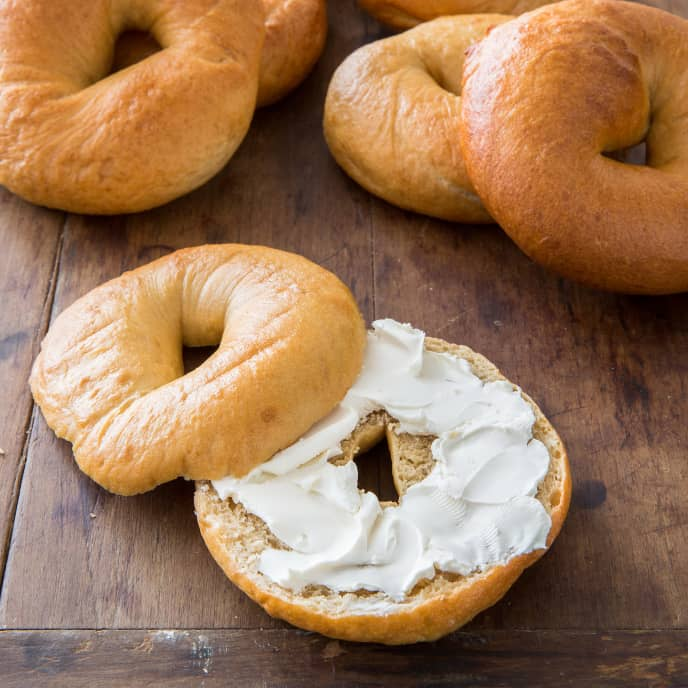

# Bagels

| :timer_clock: Total Time |
|:-----------------------: |
| 1.08 days |

## :salt: Ingredients

- 2.66 cups (319 g)bread flour
- 4 tsp vital wheat gluten
- 2 tsp instant yeast
- 9 oz ice water
- 2 Tbsp malt syrup
- 2 tsp salt
- 0.25 cup (39 g) cornmeal
- 0.25 cup (50 g) sugar
- 1 Tbsp baking soda

## :cooking: Cookware

- 1 food processor
- 1 bowl
- 1 Whisk
- 1 plastic wrap
- 1 baking sheet

## :pencil: Instructions

### Step 1

In a food processor add: 14.66 ounces of bread flour, 4 tsp of vital wheat gluten, and 2 tsp of instant yeast. Pulse to
combine.

### Step 2

Next combine 9 ounces of ice water and 2 Tbsp of malt syrup in a bowl. Whisk to mix. Turn food processor on low and add
the cold water and malt syrup mixture. Mix for about 20 seconds, stop, and let it sit for 10 minutes. Once it has rested
for 10 minutes, add 2 tsp of salt. Turn the food processor on medium to high for about 90 seconds.

### Step 3

Remove dough from food processor and knead for about 1 minutes. Next, divide dough into 3.5 ounce pieces. Roll the
pieces into tight balls and cover with plastic wrap and let rest for 15 minutes. Once they have rested, decide which
method you will use to turn your balls of dough into bagels. For the best tutorial, watch the episode to see the
difference in the methods.

### Step 4

Option 1 - Twist Method: Roll out a piece of dough with a rolling pin until it’s roughly 5 inches across. Next, start
from one end of the circle and start rolling the dough onto itself. Once it is rolled into a tight roll that is 9-10
inches long, it’s time to twist the dough. Place one hand on each side of the dough roll and then roll the ends in
opposite directions to create the “twist”. Wrap the dough around your hand and then pinch the ends together. With
the ring of dough still wrapped around your hand, roll the dough on your work surface to seal together.

### Step 5

Option 2 - Punch Method: Take a ball of dough and place it on your work surface. Stick one finger into the center and
shake the dough around your finger until a round hole forms. Pick up the dough and shape it with two fingers, coaxing it
into a bagel shape. This method is easier, but doesn’t yield as great of a bagel texture as the twist method.

### Step 6

Place the bagels on a baking sheet covered in cornmeal. Cover that with plastic wrap and let sit for 1 hour. Once
they’ve sat for an hour, place them in the fridge overnight or for 24 hours.

### Step 7

Bring water in a pot to a boil and add 1/4 cup of sugar and 1 Tbsp of baking soda. Add the bagels to the water and boil
for about 20 seconds on each side.

### Step 8

Remove and place them on a wire rimmed baking sheet, making sure the cornmeal side is down. If you’d like to add
toppings, now is the time to do it.

### Step 9

Add 1/2 cup of boiling water to the bottom of the pan and then place in the oven at 450°F for 20 to 25 minutes flipping
them halfway through.

### Step 10

Let cool, serve, and enjoy!

## :link: Source

- <https://basicswithbabish.co/basicsepisodes/bagels>
