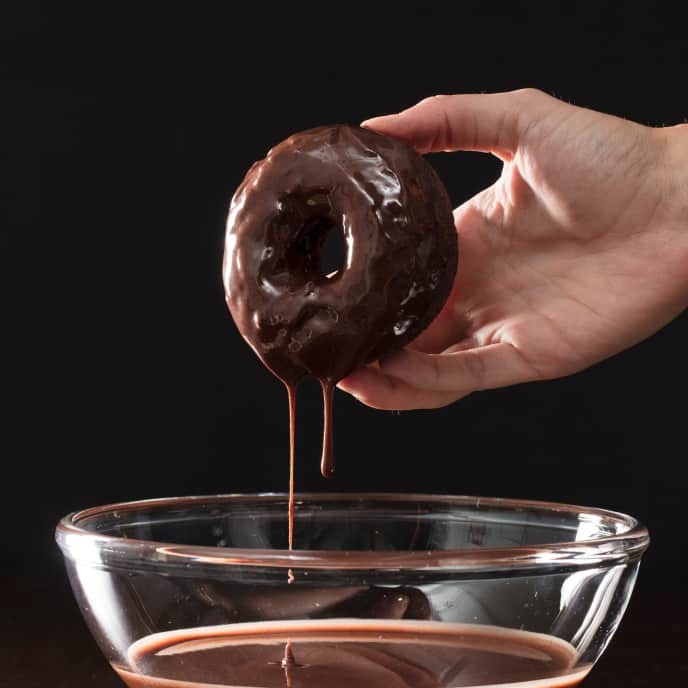

# :doughnut: Chocolate Cake Doughnuts

| :fork_and_knife_with_plate: Serves | :timer_clock: Total Time |
|:----------------------------------:|:-----------------------: |
| 12 | 0 minutes |

## :salt: Ingredients

### :doughnut: Doughnuts

- :ear_of_rice: 2.25 cups all-purpose flour
- :chocolate_bar: 1 cup unsweetened cocoa powder
- :dash: 1 tsp baking powder
- :cup_with_straw: 0.5 tsp baking soda
- :salt: 0.75 tsp salt
- :butter: 4 Tbsp butter
- :candy: 1 cup sugar
- :egg: 1 large egg
- :rice: 1.5 cup sour cream
- :oil_drum: 3 qts vegetable oil

### Glaze

- :candy: 3 cups confectioners' sugar
- :glass_of_milk: 0.5 cup whole milk
- :chocolate_bar: 0.25 cup unsweetened cocoa powder

## :cooking: Cookware

- 1 bowl
- 1 stand mixer
- 1 rolling pin
- 1 3-inch doughnut cutter
- 1 wire rack
- 1 paper towels
- 1 large Dutch oven
- 1 slotted spoon or wire skimmer

!!! note
    Use a Dutch oven that holds 6 quarts or more. If you don't have a 3-inch doughnut cutter, use a 3-inch round
    biscuit cutter and stamp out the holes with a 1.5-inch biscuit cutter.

## :pencil: Instructions - Doughnuts

### Step 1

Whisk all-purpose flour, unsweetened cocoa powder, baking powder, baking soda, and salt together in
bowl; set aside. Using stand mixer fitted with paddle, beat butter and sugar on medium-high speed until pale and fluffy,
about 3 minutes. Add egg and beat until combined. Add sour cream and beat until smooth. Reduce speed to low and add
flour mixture in 3 additions, scraping down bowl as needed. Stir batter once or twice with rubber spatula to ensure no
dry streaks remain. Transfer batter to lightly greased bowl, cover with plastic wrap, and refrigerate for 1 hour.

### Step 2

Transfer batter to floured counter and roll with heavily floured rolling pin into 10-inch round, about ½ inch thick.
Using heavily floured 3-inch doughnut cutter, stamp out dough rings and holes, reflouring cutter between cuts. Gather
scraps and gently press into disk; repeat rolling and stamping process until all dough is used. Transfer doughnuts and
holes to lightly floured rimmed baking sheet, cover, and refrigerate for 30 minutes.

### Step 3

Set wire rack in second rimmed baking sheet and line with triple layer of paper towels. Add vegetable oil to large Dutch
oven until it measures about 2 inches deep and heat over medium-high heat to 375°F. Carefully place 3 doughnuts and 3
doughnut holes into hot oil and fry until golden brown, about 45 seconds per side for holes and 60 seconds per side for
doughnuts. Adjust burner, if necessary, to maintain oil temperature between 350°F and 375°F. Using slotted spoon or
wire skimmer, transfer doughnuts to prepared rack. Return oil to 375°F and repeat with remaining doughnuts and holes in
3 batches; let cool slightly.

## :pencil: Instructions - Glaze

### Step 4

Whisk confectioners' sugar, whole milk, and unsweetened cocoa powder in bowl until combined. Once
doughnuts are cool enough to handle, remove paper towels from rack. Dip both sides of each doughnut and doughnut hole
into glaze, shaking off any excess, and return to wire rack. Let sit until glaze has set, about 10 minutes. Serve.

## :link: Source

- Cook's Illustrated
