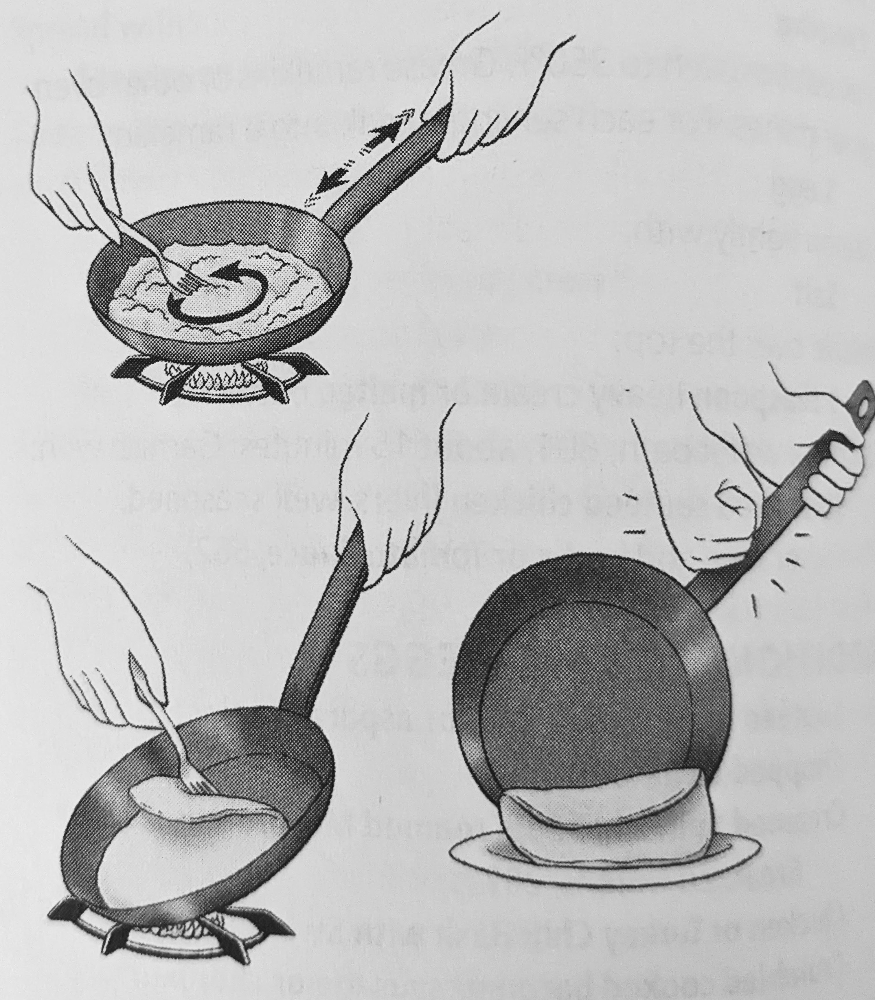

# :egg: French Omelet

| :fork_and_knife_with_plate: Serves | :timer_clock: Total Time |
|:----------------------------------:|:-----------------------: |
| 1 | 10 minutes |

## :salt: Ingredients - Omelet

- :egg: 2 large eggs
- :salt: 0.13 tsp salt
- :salt: 1 pinch pepper
- :butter: 1 Tbsp unsalted butter

## :salt: Ingredients - Fillings

- :herb: some chives
- :herb: some parsley
- :eggplant: some [ratatouille provençale][1]
- :mushroom: some creamed mushrooms
- :avocado: some guacamole and salsa fresca
- :cheese_wedge: some ricotta or goat cheese mixed with tomatoes and herbs
- :olive: some chopped olives and sour cream
- :mushroom: some duxelles
- :onion: some caramelized onions
- :cucumber: some sautéed zucchini or asparagus tips

## :cooking: Cookware

- 1 8 to 10 inch skillet

## :pencil: Instructions - Omelet

!!! note

    For French omelets both rolled and folded, the eggs should be beaten only enough to thoroughly blend the whites and
    yolks, not enough to incorporate air or make them frothy. Using a fork rather than a whisk to beat the eggs helps
    ensure that you do not overbeat them.

!!! note

    When making more than one omelet, beat the total number of eggs you will need, then use a ladle or measuring cup
    to pour 3.5 ounces, or about 1/2 cup, for each 2 egg omelet. Keep the butter and filling ingredients by the stove and
    move quickly, as you make the omelets one by one. Serve them as they are ready, or keep them warm in a 200°F oven and
    serve when all are finished. If you have more than 4 to make, use another pan, or even two. Attention to more than one
    pan at a time is a skill that needs to be developed, so practice before your debut. Stagger the cooking so the omelets
    are not all at the same stage at once.

### Step 1

Beat with a fork until the whites and yolks are blended: 2 large eggs, 1/8 teaspoon salt, a pinch of black pepper.

### Step 2

Melt in an 8 to 10 inch skillet, preferably nonstick, over medium-high heat: 1 tablespoon unsalted butter.

### Step 3

Tilt the skillet to coat the sides and bottom thoroughly. You can also use nonstick cooking spray or a combination of
butter and oil. When the butter is hot and has reached the point of fragrance, but is not brown, pour in the eggs.
Meanwhile, agitate the pan forward and backward with the left hand. Keep the egg mass sliding as a whole over the pan
bottom. With a dinner fork, quickly swirl the eggs with a circular motion, as shown. Hold the fork so the tines are
parallel to, but not scraping, the base of the pan.

### Step 4

At this point the heat in the pan may be sufficient to cook the eggs, and you may want to lift the pan from the heat as
you gently swirl the eggs, as illustrated, in circular scrolls from the edges to the center. Pay no attention to the
ridges formed by the fork. The rhythm of the pan and the stirring is like a child's trick of patting the head while
rubbing the stomach. Have ready a hot serving plate, which helps to inflate the omelet; choose a heat-resistant one if
you plan to glaze. Whether you fill your omelet or leave it plain, grasp the handle of the pan so the left palm is up,
as shown. Tip the pan down away from the handle and, with the fork, flip about one third of the omelet over, away from
the handle, as shown in the center. If the omelet shows any tendency to stick, discard the fork and give the pan handle
a sharp rap or two with the fist, as sketched. The omelet will flip over without the use of a fork and will start to
slide. Slant the pan to 90° or more until the omelet makes a second fold in sliding out of the pan and lies with its
ends folded under on the plate ready to serve.

### Step 5

Glaze and garnish, if you wish, and serve at once.

## :pencil: Instructions - Fillings

### Step 6

Herbs, such as chives and parsley or finely grated cheese may be added to the beaten eggs before cooking or more
substantial fillings may be placed in the middle of the omelet just before it is rolled. Use 1/3 to 1/2 cup filling at
room temperature for a 2 egg omelet. [ratatouille provençale][1], creamed mushrooms, guacamole and salsa fresca,
ricotta or goat cheese mixed with tomatoes and herbs, chopped olives and sour cream, duxelles, caramelized onions, and
sautéed zucchini or asparagus tips.

## :link: Source

- Joy of Cooking

[1]: <../vegetarian/ratatouille-provençale.md>
