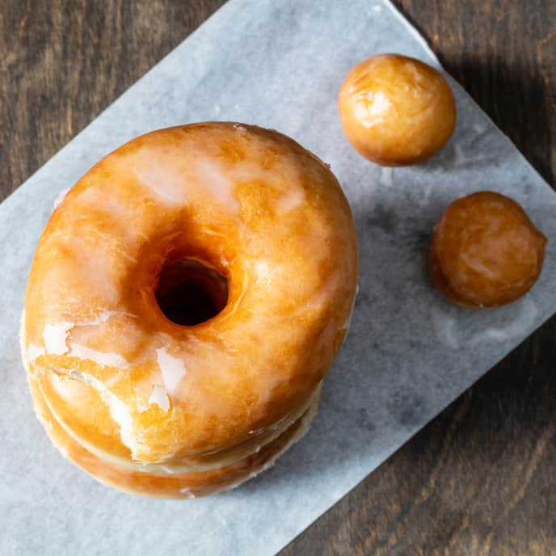

# :doughnut: Yeasted Doughnuts

| :fork_and_knife_with_plate: Serves | :timer_clock: Total Time |
|:----------------------------------:|:-----------------------: |
| 12 | 1.25 hours |

## :salt: Ingredients

### Doughnuts

- :ear_of_rice: 4.5 cups (22.5 oz) all-purpose flour
- :candy: 0.5 cup (3.5 oz) sugar
- :microbe: 1 tsp instant yeast
- :glass_of_milk: 1.5 cup milk
- :egg: 1 large egg
- :salt: 1.5 tsp salt
- :butter: 8 Tbsp butter

### Glaze

- :candy: 3.25 confectioners' sugar
- :hotsprings: 0.5 cup hot water
- :salt: 1 pinch salt

### Frying

- :oil_drum: 2 qt vegetable oil

## :cooking: Cookware

- 1 large baking sheets
- 1 wire racks
- 1 3 inch round cutter
- 1 1 inch round cutter
- 1 Dutch oven
- 1 stand mixer
- 1 rubber spatula
- 1 plastic wrap
- 1 large bowl
- 1 loaf pan
- 1 rimmed baking sheet
- 1 parchment paper
- 1 spider skimmer

## :pencil: Instructions

### Step 1

You'll need two large baking sheets and two wire racks for this recipe. You'll also need 3 inch round cutter and 1 inch
round cutter. For the best results, weigh the flour for the doughnuts and the confectioners' sugar for the glaze.
Heating the oil slowly will make it easier to control the temperature when frying. Use a Dutch oven that holds 6 quarts
or more.

### Step 2

FOR THE DOUGHNUTS: Stir all-purpose flour, sugar, and instant yeast together in bowl of stand mixer. Add milk and egg
and mix with rubber spatula until all ingredients are moistened. Fit stand mixer with dough hook and mix on medium-low
speed until cohesive mass forms, about 2 minutes, scraping down bowl if necessary. Cover bowl with plastic wrap and let
stand for 20 minutes.

### Step 3

Add salt and mix on medium-low speed until dough is smooth and elastic and clears sides of bowl, 5 to 7 minutes. With
mixer running, add 1/2 inch pieces of softened butter, a few pieces at a time, and continue to mix until butter is fully
incorporated and dough is smooth and elastic and clears sides of bowl, 7 to 13 minutes longer, scraping down bowl
halfway through mixing. Transfer dough to lightly greased large bowl, flip dough, and form into ball. Cover bowl with
plastic. Let sit at room temperature for 1 hour. Transfer to refrigerator and chill overnight (or up to 48 hours).

### Step 4

Adjust oven racks to lowest and middle positions. Place loaf pan on lower rack. Line rimmed baking sheet with parchment
paper and grease parchment. Transfer dough to lightly floured counter. Press into 8-inch square of even thickness,
expelling as much air as possible. Roll dough into 10 by 13-inch rectangle, about 1/2 inch thick. Using 3-inch round
cutter dipped in flour, cut 12 rounds. Using 1-inch cutter dipped in flour, cut hole out of center of each round.
Transfer doughnuts and holes to prepared sheet. (If desired, use 1-inch cutter to cut small rounds from remaining dough.
Transfer to sheet with doughnuts.) Bring kettle or small saucepan of water to boil.

### Step 5

Pour 1 cup boiling water into loaf pan. Place sheet on upper rack, uncovered. Close oven and allow doughnuts to rise
until dough increases in height by 50 percent and springs back very slowly when pressed with your knuckle, 45 minutes to
1 hour.

### Step 6

FOR THE GLAZE: Whisk confectioners' sugar, hot water, and salt in medium bowl until smooth.

### Step 7

About 20 minutes before end of rising time, add vegetable oil to large Dutch oven until it measures about 1½ inches
deep and heat over medium-low heat to 360°F. Set wire rack in second rimmed baking sheet and line with triple layer of
paper towels. Using both your hands, gently place 4 risen doughnuts in oil. Cook until golden brown on undersides, 1 to
1.5 minutes, adjusting burner as necessary to maintain oil temperature between 350°F and 365°F. Using spider skimmer,
flip doughnuts and cook until second sides are browned, 1 to 1.5 minutes. Transfer doughnuts to prepared rack. Return
oil to 360°F and repeat with remaining doughnuts. For doughnut holes, transfer all to oil and stir gently and
constantly until golden brown, about 2 minutes. Transfer to prepared rack to cool. Let doughnuts sit until cool enough
to handle, at least 5 minutes.

### Step 8

Set clean wire rack in now-empty sheet. Working with 1 doughnut at a time, dip both sides of doughnut in glaze, allowing
excess to drip back into bowl. Place on unlined rack. Repeat with doughnut holes. Let doughnuts and holes stand until
glaze has become slightly matte and dry to touch, 15 to 30 minutes, before serving.

## :link: Source

- <https://www.americastestkitchen.com/recipes/12601-yeasted-doughnuts>
