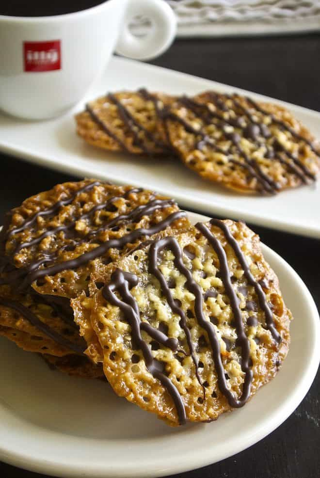

# :cookie: Florentines

| :fork_and_knife_with_plate: Serves | :timer_clock: Total Time |
|:----------------------------------:|:-----------------------: |
| 30 | 42 minutes |

## :salt: Ingredients

- :chestnut: 145 g almonds
- :ear_of_rice: 3 Tbsp all-purpose flour
- :orange_circle: 2 Tbsp orange peel (optional)
- :candy: 140 g granulated sugar
- :icecream: 2 Tbsp heavy cream
- :corn: 2 Tbsp light corn syrup
- :butter: 71 g unsalted butter
- :icecream: 0.5 tsp vanilla
- :chocolate_bar: 567 g milk or dark chocolate

## :cooking: Cookware

- 1 17 x 12 inch (43 x 30 cm) baking or cookie sheet
- 1 parchment paper or a silicone mat
- 1 food processor or blender
- 1 small saucepan
- 1 sharp knife
- 1 cooling rack

## :pencil: Instructions

### Step 1

Position oven rack in the center of the oven. Preheat oven to 325°F/163°C. Line a large 17 x 12 inch (43 x 30 cm)
baking or cookie sheet with parchment paper or a silicone mat.

### Step 2

To peel the almonds: Over high heat, bring a saucepan of water to a boil. Add the almonds and boil for 1 minute (no
longer because they will soften). Drain and rinse with cold water to cool and stop them from cooking. Spread onto a
towel and rub them until the peels come off. Dry well.

### Step 3

Add the almonds to a food processor or blender and pulse until finely chopped.

### Step 4

In a mixing bowl, stir together the almonds, all-purpose flour and orange peel.

### Step 5

To a small saucepan add the granulated sugar, heavy cream, light corn syrup and unsalted butter. Cook over medium heat,
stirring occasionally until the mixture comes to a rolling boil and the sugar is completely dissolved. Continue to
simmer for 1 minute.

### Step 6

Remove from the heat and add the mixture to the almond mix along with the vanilla. Stir until combined. Allow to cool
until it is cool enough to handle, about 15 minutes.

### Step 7

Using a teaspoon measuring spoon, portion out 1 teaspoon of dough and roll into a ball using your hands. Roll the balls
as round as you can, this will ensure nice round cookies. If the dough seems dry and crumbly, simply put a ball of the
dough your warm hand it will soften so you can shape.

### Step 8

Place the dough balls 6 inches (15 cm) apart on to the prepared baking sheet. They spread to 3 inches (7.5 cm) in
diameter. You'll need to work in batches to fit your baking sheet.

### Step 9

Bake for 10 to 12 minutes or until golden brown. If they join together, use a sharp knife to separate while they are hot
and soft on the baking sheet as they will harden very quickly.

### Step 10

Remove from the oven and allow to cool on the baking sheet for 2 minutes until they are no longer soft, then transfer to
a cooling rack. Repeat with the remaining dough.

### Step 11

In a microwave safe bowl, add the milk or dark chocolate and microwave in 10 second increments, stirring in between
until melted. Be careful not to burn.

### Step 12

Take a cooled cookie, spread the chocolate on one side, take another cookie and make a sandwich, press carefully as they
are delicate. Repeat with all cookies.

### Step 13

If you would like to drizzle chocolate on the top, put the melted chocolate into a small zip top bag. Snip of a very
tiny piece of the corner and this will allow you to get the perfect drizzle.

### Step 14

Allow the cookies to cool and store in an air tight container in the refrigerator for up to 2 weeks.

## :link: Source

- <https://culinaryginger.com/florentine-cookies/>
