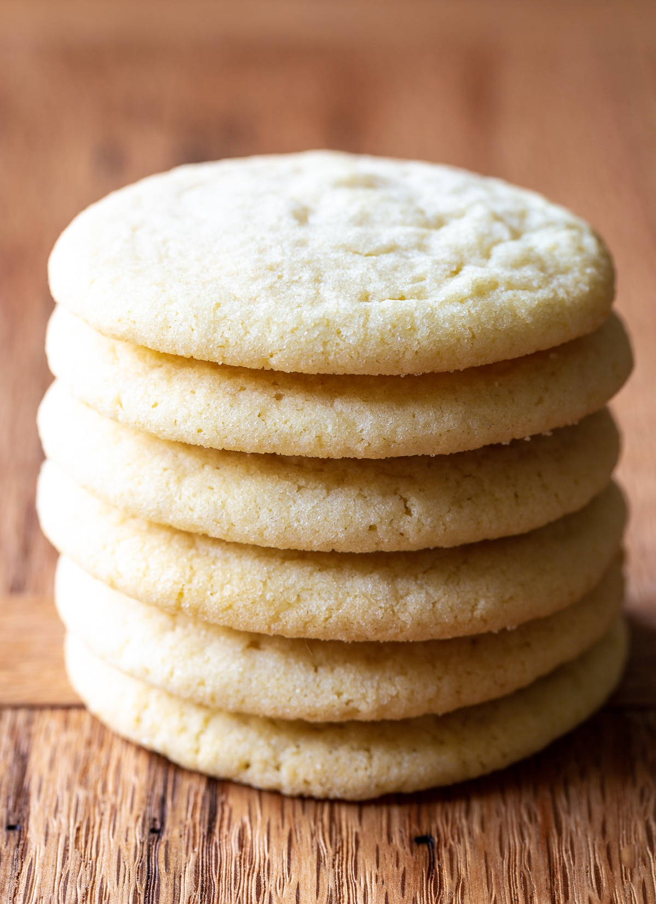

# :cookie: The Best Sugar Cookies

| :timer_clock: Total Time |
|:-----------------------: |
| 2.25 hours |

## :salt: Ingredients

- :ear_of_rice: 281 g all-purpose flour
- :dash: 0.5 tsp baking powder
- :salt: 0.25 tsp salt
- :butter: 170 g unsalted butter
- :candy: 150 g granulated sugar
- :egg: 1 large egg
- :icecream: 2 tsp vanilla
- :chestnut: 0.5 tsp almond extract
- :crown: some royal icing (optional)

## :cooking: Cookware

- 1 medium bowl
- 1 hand mixer or a stand mixer
- 1 large baking sheets
- 1 parchment paper or silicone baking mats

## :pencil: Instructions

### Step 1

Whisk the all-purpose flour, baking powder, and salt together in a medium bowl. Set aside.

### Step 2

In a large bowl using a hand mixer or a stand mixer fitted with a paddle attachment, beat the unsalted butter and
granulated sugar together on high speed until completely smooth and creamy, about 2 minutes. Add the egg, vanilla, and
almond extract (if using) and beat on high speed until combined, about 1 minute. Scrape down the sides and up the bottom
of the bowl and beat again as needed to combine.

### Step 3

Add the dry ingredients to the wet ingredients and mix on low until combined. Dough will be relatively soft. If the
dough seems too soft and sticky for rolling, add 1 more Tablespoon of flour.

### Step 4

Divide the dough into 2 equal parts. Place each portion onto a piece of lightly floured parchment paper or a lightly
floured silicone baking mat. With a lightly floured rolling pin, roll the dough out to about 1/4 inch thickness. Use
more flour if the dough seems too sticky. The rolled-out dough can be any shape, as long as it is evenly 1/4 inch thick.

### Step 5

Lightly dust one of the rolled-out doughs with flour. Place a piece of parchment on top. (This prevents sticking.) Place
the 2nd rolled-out dough on top. Cover with plastic wrap or aluminum foil, then refrigerate for at least 1 to 2 hours
and up to 2 days.

### Step 6

Once chilled, preheat oven to 350°F (177°C). Line 2 to 3 large baking sheets with parchment paper or silicone baking
mats. Carefully remove the top dough piece from the refrigerator. If it’s sticking to the bottom, run your hand under
it to help remove it. Using a cookie cutter, cut the dough into shapes. Re-roll the remaining dough and continue cutting
until all is used. Repeat with 2nd piece of dough.

!!! note

    It doesn’t seem like a lot of dough, but you get a lot of cookies from the dough scraps you re-roll.

### Step 7

Arrange cookies on baking sheets 3 inches apart. Bake for 11 to 12 minutes or until lightly browned around the edges. If
your oven has hot spots, rotate the baking sheet halfway through bake time. Allow cookies to cool on the baking sheet
for 5 minutes then transfer to a wire rack to cool completely before decorating.

### Step 8

Decorate the cooled cookies with [royal icing][1] or easy cookie icing. Feel free to tint either icing with gel food
coloring. See post above for recommended decorating tools. No need to cover the decorated cookies as you wait for the
icing to set. If it’s helpful, decorate the cookies directly on a baking sheet so you can stick the entire baking
sheet in the refrigerator to help speed up the icing setting.

### Step 9

Enjoy cookies right away or wait until the icing sets to serve them. Once the icing has set, these cookies are great for
gifting or for sending. Plain or decorated cookies stay soft for about 5 days when covered tightly at room temperature.
For longer storage, cover and refrigerate for up to 10 days.

## :link: Source

- <https://sallysbakingaddiction.com/best-sugar-cookies/>

[1]: <../ingredients/post-baking-glazes/royal-icing.md>
