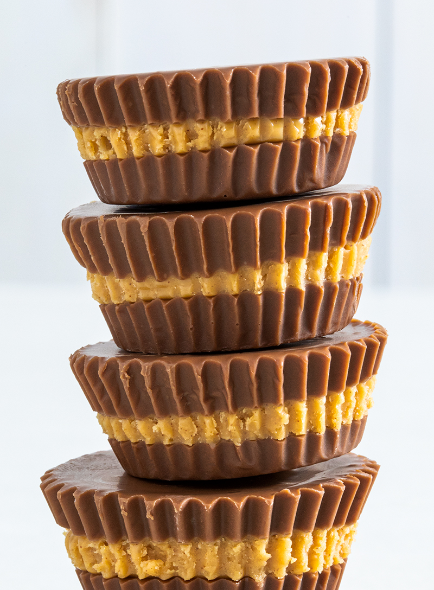

# :peanuts: Peanut Butter Cups

| :fork_and_knife_with_plate: Serves | :timer_clock: Total Time |
|:----------------------------------:|:-----------------------: |
| 24 mini cups | 40 minutes |

## :salt: Ingredients

- :chocolate_bar: 12 oz milk chocolate
- :peanuts: 0.5 cup [creamy peanut butter][1]
- :candy: 3 Tbsp confectioners’ sugar
- :butter: 1 Tbsp butter
- :salt: 0.13 tsp salt

## :cooking: Cookware

- 1 24‑cup mini-muffin tin
- 1 paper liners
- 1 large zipper-lock plastic bag
- 1 rolling pin
- 1 small microwave-safe bowl
- 1 rubber spatula
- 1 quart-size zipper-lock bag
- 1 scissors
- 1 oven mitts

## :pencil: Instructions

### Step 1

Line 24‑cup mini-muffin tin with 24 paper liners.

### Step 2

Place milk chocolate in large zipper-lock plastic bag and seal, removing as much air as possible from bag. Use rolling
pin to gently pound chocolate into small pieces.

### Step 3

In small microwave-safe bowl, add half of pounded chocolate. Heat in microwave at 50 percent power for 1 minute. Use
rubber spatula to stir chocolate. Return to microwave and heat at 50 percent power until melted, about 1 minute longer.
Use oven mitts to remove bowl from microwave. Use rubber spatula to stir chocolate until completely melted and smooth.

### Step 4

Pour melted chocolate into one quart-size zipper-lock bag. Push chocolate to one corner of bag and twist top. Use
scissors to snip 1/8 inch off corner of filled bag.

### Step 5

Pipe chocolate in spiral in each muffin-tin cup, working from outside in, to cover bottom of liner. Transfer muffin tin
to freezer and freeze for 15 minutes.

### Step 6

Pipe chocolate in spiral in bottom of each muffin-tin cup, working from outside in, to cover bottom of liner. Take a
break every six cups and gently tap pan on counter to even out layer of chocolate. Transfer muffin tin to freezer and
freeze for 15 minutes.

### Step 7

Meanwhile, add creamy peanut butter to second small microwave-safe bowl and heat in microwave until warm, about 1
minute. Use oven mitts to remove bowl from microwave.

### Step 8

Add confectioners’ sugar, butter, and salt to warmed peanut butter and use clean rubber spatula to stir until well
combined. Fill second quart-size zipper-lock bag with peanut butter mixture. Use scissors to snip 1/8 inch off corner of
filled bag.

### Step 9

Remove muffin tin from freezer. Pipe peanut butter mixture over chilled chocolate layer in each muffin-tin cup in spiral
to cover chocolate layer. Take a break every six cups and gently tap pan on counter to even out layer of peanut butter.

### Step 10

Add remaining pounded chocolate to bowl used to melt chocolate. Heat in microwave at 50 percent power for 1 minute. Use
rubber spatula to stir chocolate. Return to microwave and heat at 50 percent power until melted, about 1 minute longer.
Use oven mitts to remove bowl from microwave. Use rubber spatula to stir chocolate until completely melted and smooth.

### Step 11

Fill third quart-size zipper-lock bag with melted chocolate. Use scissors to snip 1/8 inch off corner of filled bag.

### Step 12

Pipe melted chocolate on top of peanut butter layer in each muffin-tin cup in spiral to cover peanut butter layer. Take
a break every six cups and gently tap pan on counter to even out layer of chocolate.

### Step 13

Transfer muffin tin back to freezer and chill for 30 minutes. Remove muffin tin from freezer and remove peanut butter
cups from pan. Serve. (Peanut butter cups can be refrigerated in airtight storage container for up to 2 weeks).

## :link: Source

- <https://www.americastestkitchen.com/kids/recipes/peanut-butter-cups>

[1]: <../ingredients/peanut-butter.md>
