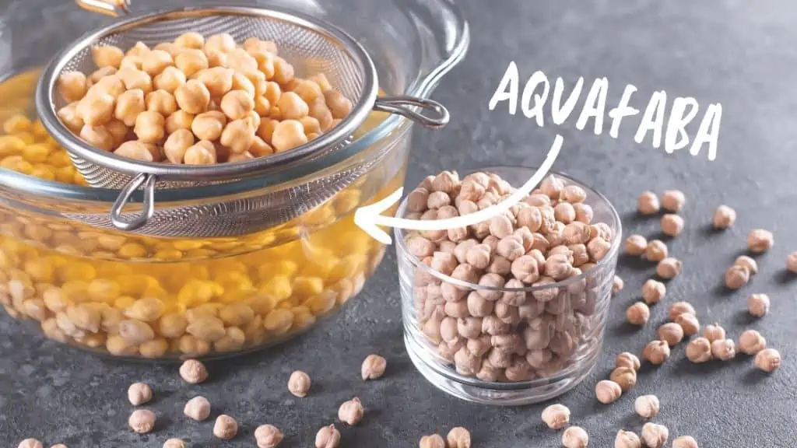

# :falafel: Aquafaba

| :timer_clock: Total Time |
|:-----------------------: |
| 2.00 hours |

## :salt: Ingredients

- :falafel: 1 cup dry chickpeas
- :droplet: some filtered water

## :triangular_ruler: Best Ways to Use Aquafaba

If you’re wondering how to use aquafaba, let us get you started with some basics—the most common uses. Aquafaba is
almost essential for everyday baking—especially for vegans—because it’s a great binder and can fluff up and trap
air and serve as an excellent alternative to eggs. Here are the most common uses:

- **Egg Replacement** – Use 3 tablespoons of liquid per egg in any recipe.
- **Meringues and Macarons** – Yay! These fancy little desserts are accessible to vegans again. Whip your aquafaba into
  impossibly stiff peaks with a hand mixer or standing mixer and a pinch of cream of tartar. This might take 10 minutes
  or more, but it’s totally worth it.
- **Aquafaba Whipped Cream** – Light fluffy vegan whipped cream made from chickpea water? Sounds preposterous, but it’s
  perfection!
- **Crusty Layer** – Brush onto potatoes or the tops of pies before baking for a little added crispiness.
- **Egg White Substitute** – Beaten into semi-stiff peaks (for about 5 minutes), this mixture is wonderful for adding
  into waffles or other baked items.
- **Chocolate Mousse** – A marvelous mousse can be made with only whipped aquafaba, sugar and dark chocolate. So creamy
  and thick, you won’t believe your eyes. This recipe from Lazy Cat Kitchen is really dreamy.
- **Buttercream Frosting** – Aquafaba makes a great base for buttercream that forms the most terrific texture. I like
  this recipe by Geeky Cakes. A bit more involved, but it produces a truly professional frosting.
- **Vegan Marshmallows or ‘Marshmallow’ Fluff** – You can make your own vegetarian marshmallows from scratch using
  aquafaba!
- **Vegan Cheese** – This recipe from Avocados and Ales is pretty popular and provides the most mouthwatering and
  meltable results for a plant-based mozzarella cheese.

## :pencil: Instructions - Stove Top Method

### Step 1

Soak 1 cup of dry chickpeas overnight in filtered water.

### Step 2

The next day, drain and rinse the beans thoroughly.

### Step 3

Add beans to a pot and cover with several inches of water.

### Step 4

Bring to a boil on high heat, lower heat, and simmer for 1.5 – 2 hours.

### Step 5

Drain bean water into another pot or large mason jar to cool.

### Step 6

Save the cooked beans to use later.

## :pencil: Instructions - Pressure Cooker Method

### Step 7

Pressure Cooker Method: Soak 1 cup of dry chickpeas overnight in filtered water.

### Step 8

The next day, drain and rinse the beans thoroughly.

### Step 9

Place beans into the Instant Pot (or your favorite pressure cooker) and add just enough liquid to cover the beans
completely.

### Step 10

Pressure cook on HIGH for 15 to 18 minutes. The longer you let them cook, the softer they will get.

### Step 11

Quick release and drain off the bean liquid into a large mason jar or other container.

### Step 12

Save the cooked beans to use later.

## :link: Source

- <https://www.worldofvegan.com/aquafaba/>
