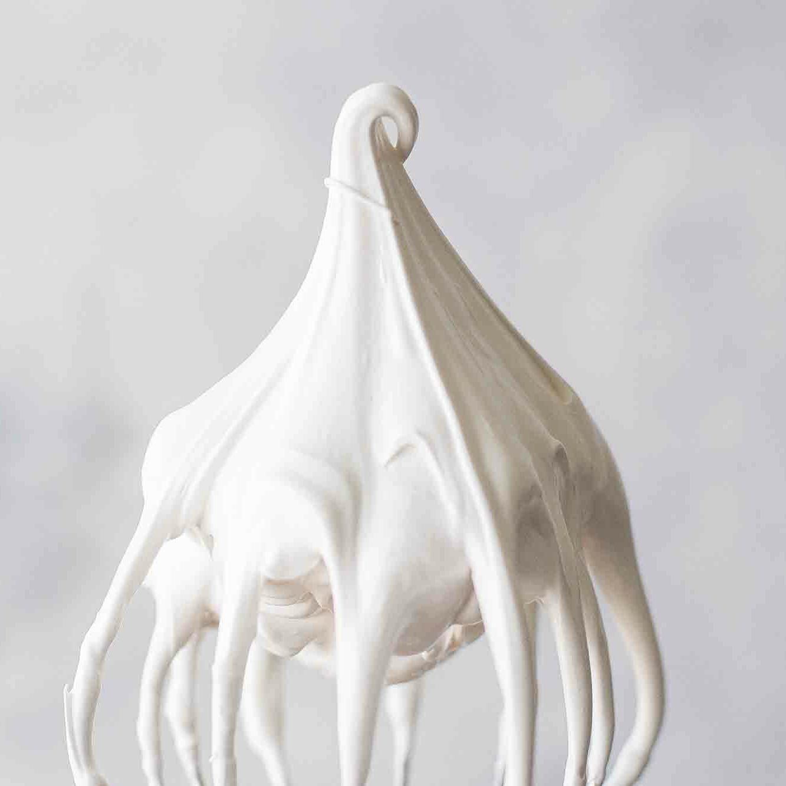

# :egg: Swiss Meringue

| :timer_clock: Total Time |
|:-----------------------: |
| 10 minutes |

## :salt: Ingredients

- :egg: 4 large egg whites
- :candy: 1 cup sugar (189 g)
- :salt: 1 pinch salt
- :icecream: 2 tsp vanilla

## :cooking: Cookware

- 1 stand mixer
- 1 saucepan

## :pencil: Instructions

### Step 1

In the bowl of a stand mixer, combine the egg whites, sugar (189 g) , and salt.

### Step 2

Bring a saucepan with a few inches of water to a simmer. Set the mixer bowl over the simmering water, making sure the
water does not touch the bottom of the bowl. Continuously, but gently, stir the mixture until the egg whites are very
warm to the touch and the sugar has dissolved, about 4 minutes. Test this by dipping a finger into the mixture and
rubbing it between your fingers—the mixture should no longer have any grains of sugar in it and should be very warm to
the touch.

### Step 3

In the bowl of a stand mixer fitted with a whisk attachment, beat the meringue on medium-low speed until foamy, about 2
minutes. Gradually increase the speed and beat until you achieve a stiff peak that droops only slightly when you lift up
the whisk, and the bottom and sides of the bowl no longer feel warm to the touch, about 4 minutes. Add the vanilla and
beat a few seconds to mix it in.

### Step 4

Swiss meringue is best when used immediately and served the same day. Do not refrigerated it in bulk or it will lose its
lightness and become weepy. However, you can frost your cake or cupcakes and refrigerate overnight if needed; the
meringue will be less airy the next day, but still fine.

## :link: Source

- <https://www.simplyrecipes.com/recipes/how_to_make_swiss_meringue/>
