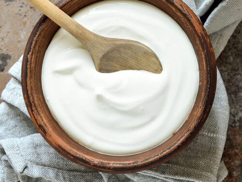

# Yogurt

| :timer_clock: Total Time |
|:-----------------------: |
| 13.66 hours |

## :salt: Ingredients

- 7.5 cups ultra-pasteurized whole, 2 percent low-fat, 1 percent low-fat, or skim milk
- 0.5 cup plain yogurt
- 5 quarts water

## :cooking: Cookware

- 1 saucepan
- 1 1-quart Mason jars
- 1 clean spoon

## :pencil: Instructions

### Step 1

Bring ultra-pasteurized whole, 2 percent low-fat, 1 percent low-fat, or skim milk to 115°F in saucepan over medium
heat, 2 to 5 minutes. (If your milk gets hotter than 115°F, let it cool to 115°F before proceeding. Higher
temperatures can kill some cultures.) Off heat, whisk plain yogurt into milk until very well combined. Divide mixture
evenly between two 1-quart Mason jars (they will be very full; a funnel can be helpful for this step). Add lids, then
screw on rings until just finger-tight.

### Step 2

Adjust oven rack to lowest position and turn on oven light. Bring 5 quarts water to boil in large covered pot. Place
jars in second large pot. Add water until jars are submerged to their necks. (If jars are taller than pot, add water to
14 inches from rim of pot.) Remove jars and bring water to 120°F over medium heat. Return jars to pot of 120°F water.
Transfer both pots to oven. Incubate yogurt, without opening oven door, for 5 hours.

### Step 3

Remove 1 jar from water bath. Using clean spoon, taste yogurt for tartness and consistency. If tarter, thicker yogurt is
desired, return jar to water bath and shut oven door. (Bear in mind that yogurt will thicken significantly as it cools
but can be loosened up by stirring prior to serving.) Set oven to 350°F and heat for 3 minutes (start your timer as
soon as you set the dial; oven will not reach 350°F). Turn off oven and let incubate for up to 10 more hours, repeating
heating step each time oven door is opened. Remove jars from water bath and refrigerate until fully cooled and set,
about 8 hours. (Yogurt can be refrigerated for up to 2 weeks.)

## How to Customize

Making yogurt that you'll love begins with choosing a starter yogurt that you enjoy. Any variety (whole milk, Greek,
Icelandic, etc.) will do the job, but keep in mind that different brands use different combinations of bacteria, and
this accounts for variability in flavors ranging from buttery to cheesy to tangy to mild; textures can be firm, thin,
gelatinous, ropy, or custardy. These qualities will transfer to your finished yogurt.

Then there's the milk. Any type (whole, low-fat, or skim) will work, but the more fat your milk contains, the richer
your yogurt will be and the more structure it will have. And yet, the starter and milk are only the beginning Here
are more ways to create a truly artisanal yogurt to suit your personal tastes.

## Tweak the Consistency

### Richer

Substitute 1/2 cup ultra-pasteurized heavy cream for 1/2 cup milk.

### Denser

Whisk 1/4 cup nonfat dry milk powder into cold milk before heating it.

### Strained

Place triple layer of cheesecloth over mouth of jar with chilled yogurt, screw on lid ring, and drain in refrigerator
upside down in 2-cup measuring cup overnight.

## Add Flavorings

### Extract

Stir 1/4 tea spoon extract (we like vanilla or almond) into milk along with starter.

### Sweetener

Garnish individual servings with white or brown sugar, honey, maple syrup, or fruit jam.

## Control Sourness & Thickness

Adjust the incubation time to produce the effect you desire: The longer yogurt ferments, the more lactic acid is
produced, and the more sour and thick it becomes. Chilling stops fermentation and allows the gel to set fully (it will
loosen when stirred or served).

### Mild & Thin

Incubate for 5 hours.

### Tart & Thick

Incubate for up to 15 hours.

!!! note
    Extra-tart yogurt is great for making frozen yogurt

## :link: Source

- Cook's Illustrated
