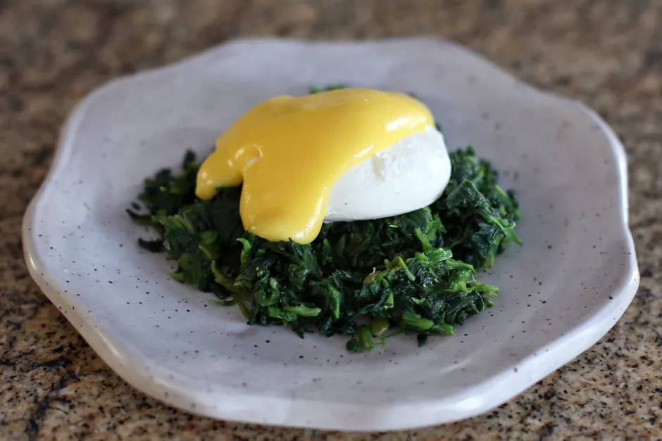

# :egg: Hollandaise

| :timer_clock: Total Time |
|:-----------------------: |
| 15 minutes |

## :salt: Ingredients

- :butter: 0.5 cup butter
- :egg: 3 large egg yolks
- :lemon: 1 Tbsp lemon juice
- :salt: 0.13 tsp salt
- :hot_pepper: 1 dash cayenne pepper
- :herb: some parsley

## :cooking: Cookware

- 1 medium saucepan

## :pencil: Instructions

### Step 1

Gather the ingredients.

### Step 2

Melt the butter in a saucepan until it is hot and foaming, but do not let it brown. Keep it warm.

### Step 3

Place a medium saucepan or bottom of a double boiler pan with about an inch of hot water over low heat and bring it to a
simmer.

### Step 4

In a stainless steel bowl or top pan of a double boiler, vigorously whisk the egg yolks with the lemon juice until the
mixture is thickened.

### Step 5

Place the bowl or pan over the simmering water and continue whisking.

### Step 6

Drizzle the melted butter into the egg yolk mixture in a slow, steady stream while whisking. Continue whisking until the
sauce has thickened. Take care not to let the bowl or top pan sit in the simmering water or you'll end up with scrambled
eggs. And don't let the sauce get too hot or it could break. If it does start to look curdled, try whisking in a small
amount of boiling water a half-teaspoon at a time.

### Step 7

Remove the sauce from the heat and whisk in the salt and cayenne pepper or hot pepper sauce.

### Step 8

The sauce is best served immediately, but if it must be held, place the bowl in a pan with hot water or put it in the
top of a double boiler over hot water. Keep it on very low heat. Too long or too hot and the sauce will break.

### Step 9

If the sauce becomes too thick on standing, whisk in a small amount of hot water to thin it.

### Step 10

Top with finely chopped parsley and enjoy.

## :link: Source

- <https://www.thespruceeats.com/classic-hollandaise-sauce-4122491>
