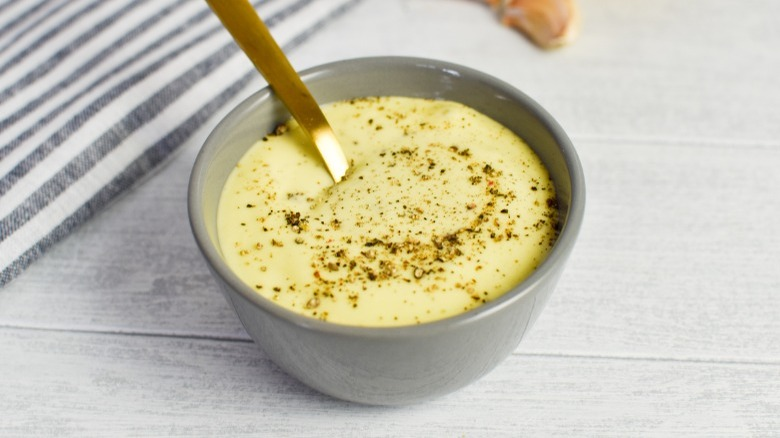

# :garlic: Garlic Aioli

| :fork_and_knife_with_plate: Serves | :timer_clock: Total Time |
|:----------------------------------:|:-----------------------: |
| 8 | 5 minutes |

## :salt: Ingredients

- :egg: 2 large eggs
- :garlic: 1 large clove garlic
- :lemon: 1 lemon
- :salt: 0.25 tsp salt
- :grapes: 0.5 cup grapeseed oil
- :olive: 0.25 cup olive oil

## :cooking: Cookware

- 1 bowl
- 1 microplane or very fine grater
- 1 food processor or blender
- 1 measuring cup

## :pencil: Instructions

### Step 1

Place the eggs in a bowl and cover with warm water to bring to room temperature.

### Step 2

Paste the garlic using a microplane or very fine grater. You can also use a garlic press, or finely mince the garlic
then smash it with the side of your knife until it turns to a paste.

### Step 3

Juice 1/2 of the lemon. Measure 1 teaspoon of fresh juice and set aside.

### Step 4

Separate the yolk from one egg and discard the white.

### Step 5

Add the egg yolk, the white and yolk of another egg, 1 teaspoon lemon juice, the garlic paste, and salt to a food
processor or blender.

### Step 6

Pulse the food processor until the ingredients are evenly blended and frothy.

### Step 7

Add the grapeseed oil and olive oil to a measuring cup. Turn the food processor on and add the oil very slowly (drop by
drop, not a stream).

### Step 8

Once the mixture starts to thicken and you can see it emulsifying (it's a consistent mixture and you can't see the oil),
then start pouring faster, in a thin stream.

### Step 9

Once all the oil is added, stop the food processor. Check the mixture — the consistency should be similar to
mayonnaise. Taste and add more salt or lemon juice, if desired.

### Step 10

Let the aioli sit for at least 1 hour before serving to allow the flavors to meld.

### Step 11

Transfer the aioli to a serving dish and top with fresh cracked black pepper.

## :link: Source

- <https://www.tastingtable.com/860102/homemade-garlic-aioli-recipe/>
