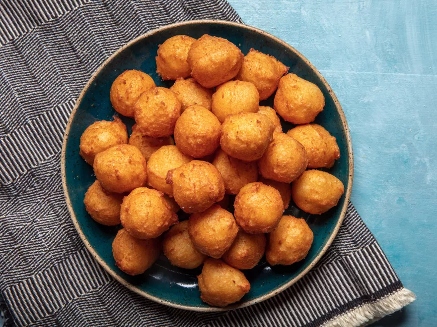

# :potato: Pommes Dauphine

| :fork_and_knife_with_plate: Serves | :timer_clock: Total Time |
|:----------------------------------:|:-----------------------: |
| 6 | 40 minutes |

## :salt: Ingredients

- :potato: 1 lb russet potatoes
- :ice_cube: 2 qt cold water
- :salt: 2 tsp salt
- :butter: 2 Tbsp butter
- :salt: some pepper
- 0.5 recipe [choux pastry][1] (made with equal parts milk and water)
- 2 qt vegetable oil

## :cooking: Cookware

- 1 medium bowl
- 1 colander
- 1 3-quart saucepan
- 1 ricer
- 1 rimmed baking sheet
- 1 flexible spatula
- 1 plastic wrap
- 1 wire rack
- 1 Dutch oven

## :pencil: Instructions

### Step 1

Place peeled and cut into 3/4-inch cubes russet potatoes in a medium bowl and cover with cool water. Using your hands,
swish potatoes until water turns cloudy, about 30 seconds. Using a colander, drain potatoes, discarding the cloudy
soaking water. Return potatoes to bowl, refill with cool water, and repeat process until water runs clear.

### Step 2

Transfer drained potatoes to a 3-quart saucepan and add 2 quarts (1.9L) cold water and salt. Bring to a boil over high
heat, then reduce heat to maintain a simmer. Cook until potatoes are tender and offer little resistance when pierced
with a paring knife, about 10 minutes. Drain potatoes in colander, then rinse with hot running water for 30 seconds to
wash away excess starch.

### Step 3

Return drained potatoes to now-empty saucepan. Heat on low heat, shaking saucepan constantly to evaporate moisture from
potatoes, about 1 minute.

### Step 4

Pass potatoes through a ricer onto a rimmed baking sheet, spreading them into an even layer, and allow them to cool
slightly, about 2 minutes.

### Step 5

Transfer riced potatoes to a medium bowl. Using a flexible spatula, stir in melted butter and season with salt and
pepper to taste. Add choux pastry, and stir until thoroughly combined, about 1 minute. Cover with plastic wrap, pressing
plastic against surface of the potato-choux mixture to prevent a skin from forming. Set aside (mixture can be held at
room temperature for up to 2 hours, or refrigerated for up to 8 hours and brought to room temperature before frying).

### Step 6

Adjust oven rack to middle position and preheat oven to 200°F (95°C). Set a wire rack inside a rimmed baking sheet and
line rack with paper towels. In a large Dutch oven, heat vegetable oil over medium-high heat to 340°F (171°C). Using a
1-tablespoon cookie scoop, scoop dough and carefully add to hot oil, dropping portion from as close to the oil’s
surface as possible to minimize splashing. (Alternatively, using a spoon, scoop roughly 1-tablespoon of dough, and using
a second spoon, gently form into a rough, oblong shape, then carefully add to hot oil). Working quickly, repeat process
with 9 more portions of dough (for a batch of 10). Fry, using a spider or slotted spoon to turn pieces as they cook,
until puffed and golden brown on all sides, about 3 1/2 minutes. Transfer pommes dauphine to prepared wire rack, season
with salt, and transfer to oven to keep warm.

### Step 7

Return oil to 340°F (171°C) and repeat frying with remaining dough, continuing to work in batches of 10. Transfer
pommes dauphine to a serving bowl and serve immediately.

## :link: Source

- <https://www.seriouseats.com/pommes-dauphine-recipe-5217321>

[1]: <../ingredients/pâte-à-choux.md>
